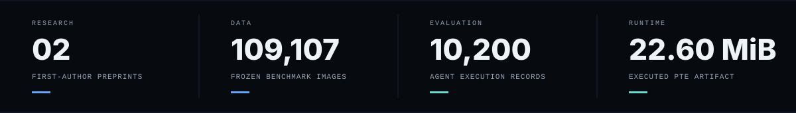

  

  I audit how AI systems fail, build ways to evaluate them, and carry models and agents into usable software.

  <a href="mailto:ranamuhammadahmed6@gmail.com">Email</a>
  &nbsp;·&nbsp;
  <a href="https://linkedin.com/in/rana-muhammad-ahmed-571057295">LinkedIn</a>
  &nbsp;·&nbsp;
  <a href="https://github.com/rana-m-ahmed">GitHub</a>

  <code>AI systems</code>&nbsp;&nbsp;<code>agent security</code>&nbsp;&nbsp;<code>edge ML</code>&nbsp;&nbsp;<code>computer vision</code>&nbsp;&nbsp;<code>full-stack AI</code>

  

## Selected systems

### 01 / [CropCop](https://github.com/rana-m-ahmed/ResearchWork-CropCop)

**Auditable computer vision from benchmark reconstruction to an executed edge artifact.**

CropCop starts with dataset forensics rather than a clean benchmark assumption: **117,546 source images** were audited, the inherited split was rejected after duplicate-family leakage was confirmed, and a **109,107-image / 120-class** benchmark was frozen with zero crossings among the audited trusted leakage groups. A compact MobileNetV4 lineage was then quantised and executed directly as a **22.60 MiB ExecuTorch/XNNPACK PTE**, retaining **98.46% internal-test accuracy**.

`benchmark auditing` `PyTorch` `MobileNetV4` `PTQ` `ExecuTorch` `XNNPACK`

[Paper](https://arxiv.org/abs/2608.25539) · [Code](https://github.com/rana-m-ahmed/ResearchWork-CropCop) · [Evidence chain](https://github.com/rana-m-ahmed/ResearchWork-CropCop#evidence-chain)

---

### 02 / [Labels Are Not Endpoints](https://github.com/rana-m-ahmed/ResearchWork-on-Mcp-Privilege-Aggregation)

**AI-agent security evaluation where the measurement itself became the object of audit.**

The preserved campaign contained **10,200 deterministic execution records**. Auditing showed that the historical security endpoint used treatment information when deciding behavioral labels, so fixed behavior could receive a different class under treatment relabeling. The corrective work reconstructs treatment-blind outcomes from preserved execution evidence and introduces treatment-invariance and endpoint-integrity checks for the closed MCP-style campaign.

`AI security` `tool-using agents` `construct validity` `evaluation` `reproducibility`

[Paper](https://arxiv.org/abs/2608.12880) · [Code](https://github.com/rana-m-ahmed/ResearchWork-on-Mcp-Privilege-Aggregation)

---

### 03 / [Synapse](https://github.com/rana-m-ahmed/Synapse)

**Multi-tenant RAG platform for turning private documents into deployable AI support agents.**

Document ingestion, chunking and embeddings feed **PostgreSQL + pgvector/HNSW** retrieval; **Supabase Auth** controls access; a **FastAPI** inference layer streams responses over SSE; and a **Next.js** control plane manages agents, analytics and a one-line embeddable web component.

`FastAPI` `Next.js` `Supabase` `pgvector` `RAG` `SSE`

---

### 04 / [Anti-LLM Injection Gateway](https://github.com/rana-m-ahmed/Anti-LLM-Injection-Gateway)

**A pre-inference security layer that converts injection, PII and secret signals into explicit policy actions.**

The gateway combines **50+ weighted prompt-injection patterns**, encoding/structural checks, Microsoft Presidio plus custom secret recognizers, and an explainable **Block / Warn / Mask / Allow** policy engine behind a FastAPI service. Its QA suite covers detector, policy, API and responsive interaction behavior.

`FastAPI` `Presidio` `prompt injection` `PII` `policy enforcement` `Playwright`

---

## More things I've built

  
<strong>ReadOut</strong> — conversational B2B analytics · <code>Next.js</code> <code>Python</code> <code>Supabase</code>

  Ask natural-language questions over uploaded datasets and receive grounded visual answers. The project includes schema-constrained analysis, a Python API, Next.js 16/React 19, Playwright/Vitest testing and axe-core accessibility checks.

  [Repository](https://github.com/rana-m-ahmed/ReadOut-B2B-Analytics-SaaS) · [Live demo](https://readoutanalytics.vercel.app/)

  
<strong>OrthoLens</strong> — explainable fracture-analysis prototype · <code>DenseNet121</code> <code>Grad-CAM</code> <code>Docker</code>

  DenseNet121 inference with structured probabilities and Grad-CAM visual explanations behind a thread-safe backend and a separate Next.js review interface. Development reference metrics include **0.9813 test AUC**; the project explicitly does not claim clinical validity.

  [Backend](https://github.com/rana-m-ahmed/ortholens-backend) · [Frontend](https://github.com/rana-m-ahmed/ortholens-frontend) · [Live demo](https://ortholens-ai.vercel.app/)

  
<strong>Haul</strong> — mobile commerce with visual search · <code>Flutter</code> <code>FastAPI</code> <code>Firebase</code> <code>Stripe</code>

  Android-first marketplace work spanning product discovery, recommendation/visual-search flows, resilient client state, backend services and server-authoritative Stripe test checkout.

  [Repository](https://github.com/rana-m-ahmed/Haul-Ecommerce-Marketplace)

  
<strong>AIDRA</strong> — hybrid AI disaster-response system · <code>A*</code> <code>CSP</code> <code>ML</code> <code>fuzzy logic</code>

  A real-time rescue simulation combining risk-aware A*, constraint allocation with MRV/forward checking, survival prediction, fuzzy urgency scoring and a Flask + Socket.IO command surface.

  [Repository](https://github.com/rana-m-ahmed/Intelligent-Disaster-Response-Agent)

  
<strong>Compresso</strong> — multithreaded lossless compression utility · <code>C++17</code> <code>Qt</code> <code>CMake</code>

  Folder-oriented archival using Canonical Huffman Coding, custom binary metadata, directory reconstruction and asynchronous desktop processing.

  [Repository](https://github.com/rana-m-ahmed/Compresso)

  
<strong>TPU Systolic Array Visualizer</strong> — cycle-by-cycle architecture simulation · <code>React</code> <code>TypeScript</code> <code>Vite</code>

  An interactive browser-side simulator for understanding TPU-style systolic matrix multiplication, with architecture references, timeline controls, reduced-motion support and automated validation.

  [Repository](https://github.com/rana-m-ahmed/TPU-Systolic-Array-Visualizer)

---

## Research index

**R01 — [Labels Are Not Endpoints: Treatment Leakage and Construct Validity in MCP Agent Security Evaluation](https://arxiv.org/abs/2608.12880)**  
Rana Muhammad Ahmed, Sabahat Abbas · arXiv preprint · 2026  
A campaign-bounded audit of treatment-contaminated security endpoints in tool-using agents, with treatment-blind reconstruction and endpoint-integrity controls.

**R02 — [CropCop: An Auditable 120-Class Plant-Health Model from Benchmark Reconstruction to a Quantised Runtime Artifact](https://arxiv.org/abs/2608.25539)**  
Rana Muhammad Ahmed, Sabahat Abbas · arXiv preprint · 2026  
A connected evidence chain spanning leakage-aware dataset reconstruction, compact-model evaluation, validation-only quantisation and direct execution of the serialized runtime artifact.

---

## Capabilities

| Domain | What I work with |
|---|---|
| **AI / ML** | PyTorch · TensorFlow/Keras · Hugging Face · scikit-learn · OpenCV · transfer learning · calibration · PTQ · ExecuTorch/XNNPACK |
| **Agents / AI security** | RAG · vector retrieval · tool-use analysis · prompt-injection evaluation · policy enforcement · PII/secret detection · endpoint integrity |
| **Product engineering** | FastAPI · Next.js · React · Flutter · PostgreSQL · Supabase · Firebase · REST APIs · streaming interfaces |
| **Engineering / systems** | Python · C++ · TypeScript/JavaScript · Dart · SQL · Docker · Linux · Git/GitHub · CI/CD · pytest · Playwright · Vitest |

---

## Experience

**2026 — now · Pakistan Telecommunication Authority (PTA), Headquarters**  
ICT Intern — Enterprise ICT, AI, Governance & DevOps. Working around reliability, governance, auditability, data handling and production practices for enterprise/public-sector systems.

**2026 · EaseZen Solutions**  
AI/ML Intern. Worked across dataset preparation, model training/evaluation, error analysis and reusable ML engineering workflows.

---

## Education / problem solving

**B.S. Computer Science — Bahria University Islamabad**  
Expected Dec 2027 · **CGPA 3.89 / 4.00** · Rector's Honour List · University Merit Scholar · Orange Tree Foundation Scholar

**The Pull Pirates — Founder & Captain**  
Competitive-programming team representing Bahria University at ICPC and national contests; represented the university at **ICPC Asia Topi Regional 2025**.

**BU GlobalX Student Ambassador**  
Supporting student access to international academic, STEM and professional opportunities.

---

## Current signal

**Open to select remote part-time / contract work** where research rigor and practical engineering meet — especially AI systems, applied ML, agent infrastructure, AI security/evaluation and full-stack AI products.

`UTC+05` · `remote` · `part-time / contract`

**Reach me:** [ranamuhammadahmed6@gmail.com](mailto:ranamuhammadahmed6@gmail.com) · [LinkedIn](https://linkedin.com/in/rana-muhammad-ahmed-571057295)

---

  RMA / SIGNAL-EVIDENCE · build systems that survive contact with reality.

